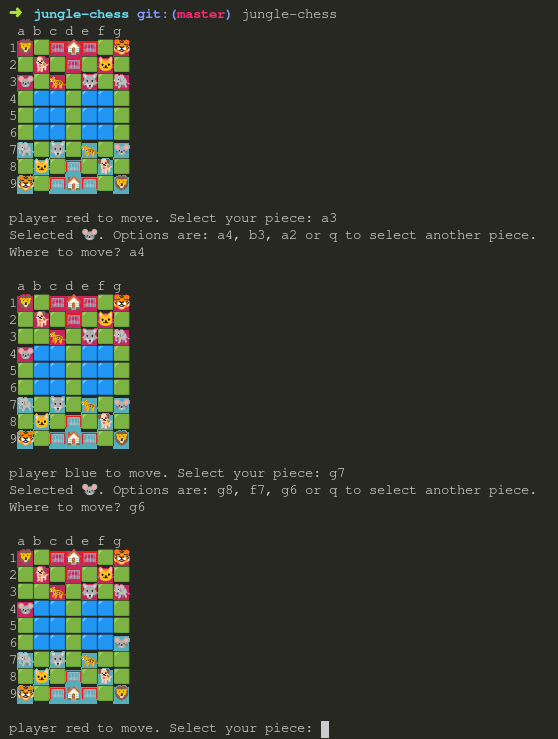

# Jungle-Chess

> This is my first project written in Rust. Happy for contributors and feedback!

Play Jungle Chess on an Emoji-Enabled Linux Terminal!



## Install

You can download binaries from the [releases tab](https://github.com/arnemileswinter/jungle-chess/releases/) or build from source by cloning this repo and invoking `cargo run --features="build-binary"`.

Running `./jungle-chess` will start the 2-player local game.

Run `./jungle-chess --ai` to play a bot match.

See `./jungle-chess --help` for more info.

## How to play

Each player tries to either: 

   - enter their opponent's Den (🏠). 
   - capture all opponent's pieces.

Player's play in turns. Each piece can move freely on the ground.

### Capturing Pieces

Every piece can capture another piece of equal or lower rank.

In order to capture a piece, the following hierarchy holds:

   - Elephant (🐘)
   - Lion (🦁)
   - Tiger (🐯)   
   - Leopard (🐆)
   - Wolf (🐺)
   - Dog (🐕)
   - Cat (🐱)
   - Rat (🐭)

Whereas the Elephant cannot capture the Rat (🐭) , but the Rat (🐭) captures the Elephant (🐘).

The Rat (🐭) can not move to capture an Elephant (🐘) while emerging from water (🟦) [see making a move](#making-a-move).

Note, however, that if a piece is on an opponent's Trap (🥅), it can be captured by *any* piece.


### Making a move

Every piece moves freely on the grass (🟩).

The Rat (🐭) is the only piece that can enter water (🟦).

The Lion (🦁) and Tiger (🐯) can jump across the water (🟦) both horizontally and vertically, but only if the line is not blocked by a Rat (🐭).

No Piece can enter their player's den(🏠).

Naturally, a piece can only move onto an occupied square, if it can capture the occupant.

## Usage as a Library

You can pull this as a dependency with cargo and write your own frontend, [like i did with web-assembly](https://github.com/arnemileswinter/jungle-chess-web).

Add to your Cargo.toml:
```toml
[dependencies]
jungle-chess = {git = "https://github.com/arnemileswinter/jungle-chess", tag = "v1.3.0"}
```
